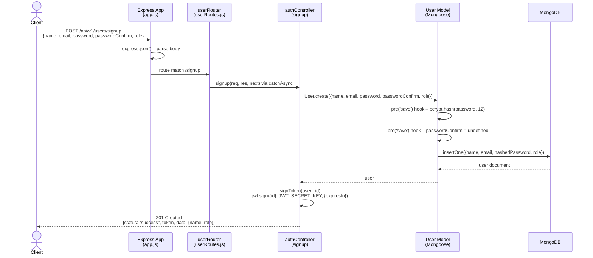
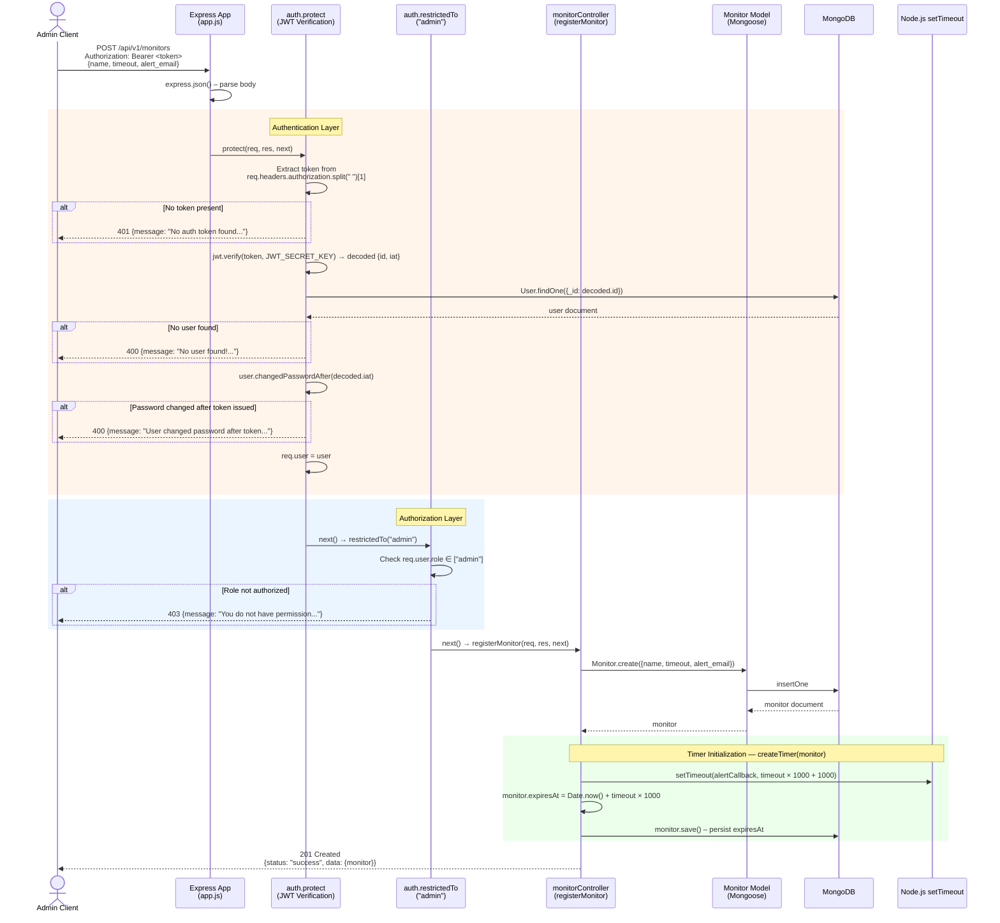
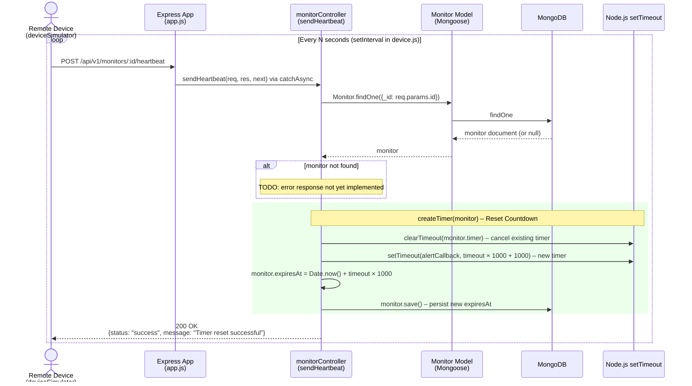
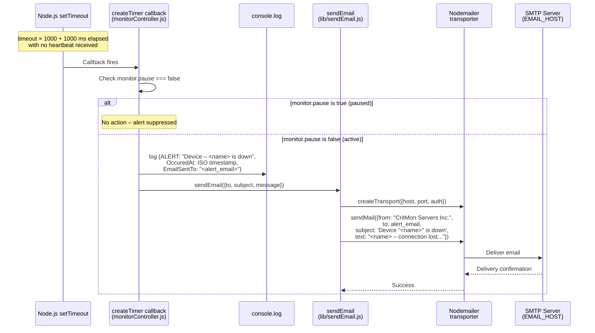
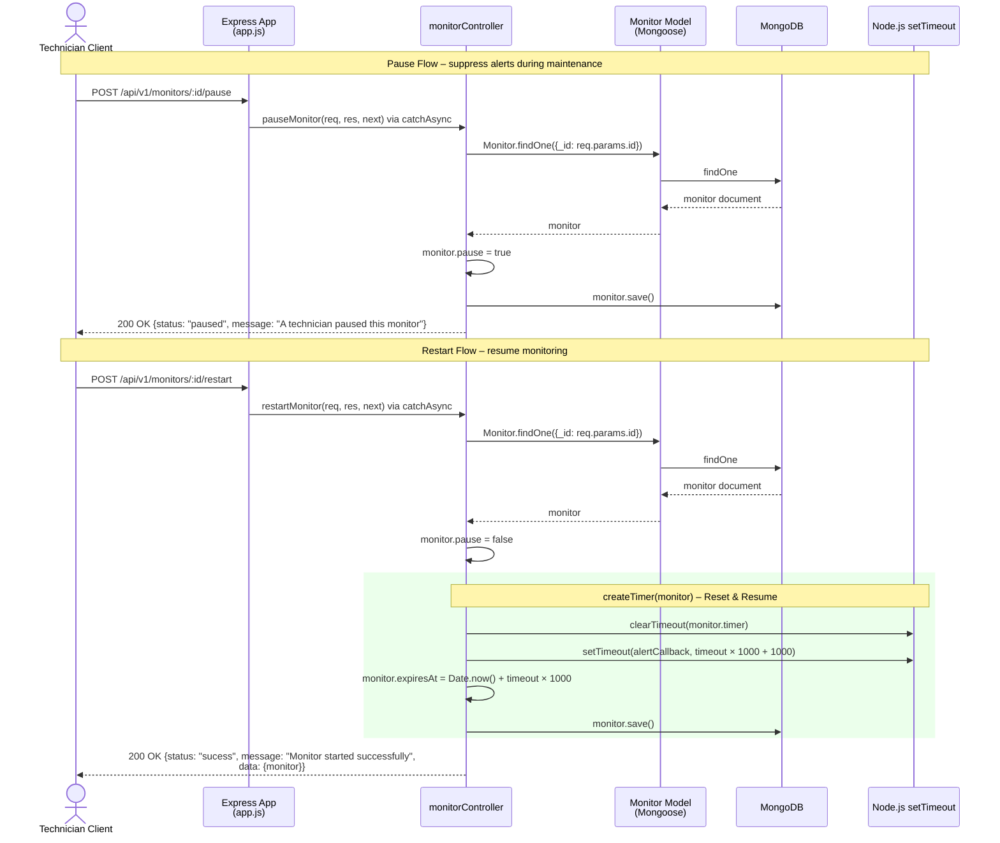
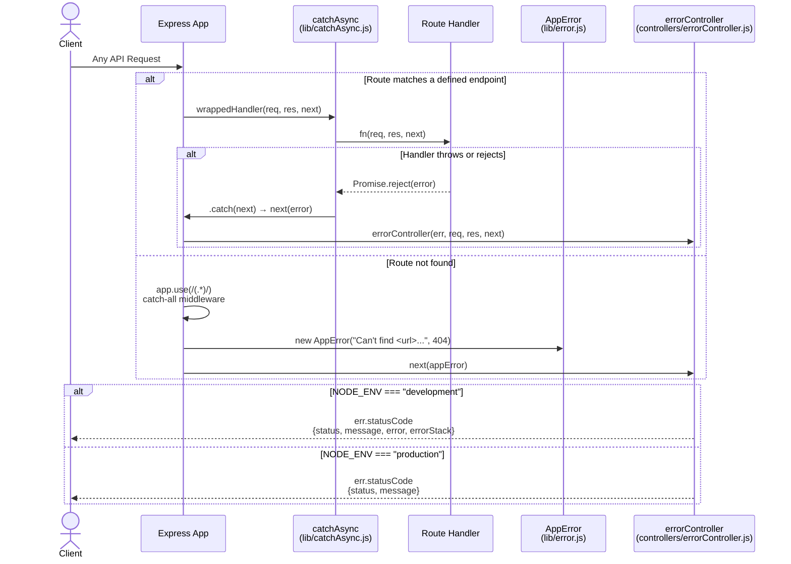

**Deliverable:** A **Sequence Diagram**.

### 1.0 User Signup & JWT Issuance

### 1.1 Register Monitor (Admin-Protected)

### 1.2 Device Heartbeat (Timer Reset)

### 1.3 Timer Expiry → Alert & Email Notification

### 1.4 Pause & Restart Monitor

### 1.5 Global Error Handling Pipeline

## The User Model

The user model helps the company add new users to the platform and secure access to protected routes.
It enforces required identity fields and handles password safety on save.

**Required fields**

- `name` (string): Required user display name.
- `email` (string): Required and validated as a proper email address.
- `password` (string): Required, minimum length 8 characters, stored as a bcrypt hash.
- `passwordConfirm` (string): Must match `password` during signup.

**Optional fields**

- `role` (string): One of `adminstrator`, `technician`, or `engineer` (defaults to `adminstrator`).
- `passwordChangedAt` (date): Used to invalidate JWTs after a password change.

**Model behavior**

- Before saving, the password is hashed with bcrypt and `passwordConfirm` is removed from storage.
- `changedPasswordAfter()` checks if a token was issued before the most recent password change.
- `correctPassword()` compares a candidate password to the stored hash during login.

---

## Authentication

Authentication and authorization logic lives in [controller/authController.js](controller/authController.js).

**Endpoints**

- `POST /api/v1/users/signup` creates a user and returns a JWT.
- `POST /api/v1/users/login` validates credentials and returns a JWT.

**JWT handling**

- When a user is signing up the user must provide `name, email, password and passwordConfirm` (this is deleted after the password is encrypted, and should match the password field during signup) and an optional `role` field which defaults to `administrator` when no role is provided during signup`

- Tokens are created with `signToken(id)` using `JWT_SECRET_KEY` and `JWT_EXPIRES_IN`.
- Clients must send `Authorization: Bearer <token>` for protected routes.

**Middleware**

- `protect` verifies the bearer token, loads the user, and checks `changedPasswordAfter`, if password was changed after the token was issued, the user is asked to login again.
- `restrictedTo(...roles)` enforces role-based access (used after `protect`).

**Notes**

- Login selects the password hash (`.select("+password")`) to verify credentials, since by default the password is set to `select: false`.
- Errors are forwarded to the `Global Error Handler` through `AppError` where applicable.

**Missing Features**

- This could be improved to allow user's change their password
- Also, featires like `change my details` for specific user can be implemented to allow user's update fields like wrongly spelt names or emails

---

## Middleware Overview

This project uses a small set of middleware functions to parse requests, guard routes, and centralize error handling. Most of them are registered in [app.js](app.js) and the auth guards live in [controller/authController.js](controller/authController.js).

**Request and logging middleware**

- `express.json()` parses JSON request bodies so handlers can access `req.body`.
- `morgan("dev")` logs requests in development mode when `NODE_ENV` is set to `development`.

**Routing middleware**

- `app.use("/api/v1/users", userRouter)` mounts the user routes defined in [routes/userRoutes.js](routes/userRoutes.js).

**Auth middleware**

- `protect` verifies JWTs, loads the user record, and blocks requests without a valid token.
- `restrictedTo(...roles)` enforces role-based access after `protect` has attached `req.user`.

**Global error handling**

- `app.use(/(.*)/, ...)` is a catch-all that creates a 404 when no route matches and forwards the error with `next(...)`.
- [controller/errorController.js](controller/errorController.js) is the final error-handling middleware. It formats error responses differently for `development` vs `production`, returning stack traces only in development.

- Asynchronous errors like `failed Database Connection` are handled gracefully so that our app does not crash. This is done by using `process.on(`unhandledRejection`)` this catches all possible skipped errors that results from asynchronous functions that wasn't well handled
- Similarly, synchronous errors like trying to access undefined variables are handled gracefully, however these errors should really crash our apps so as to be attended to immediately. These errors are handled using `process.on(`uncaughtException`)`.
