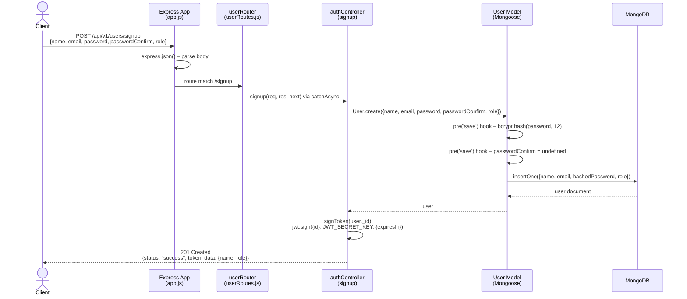
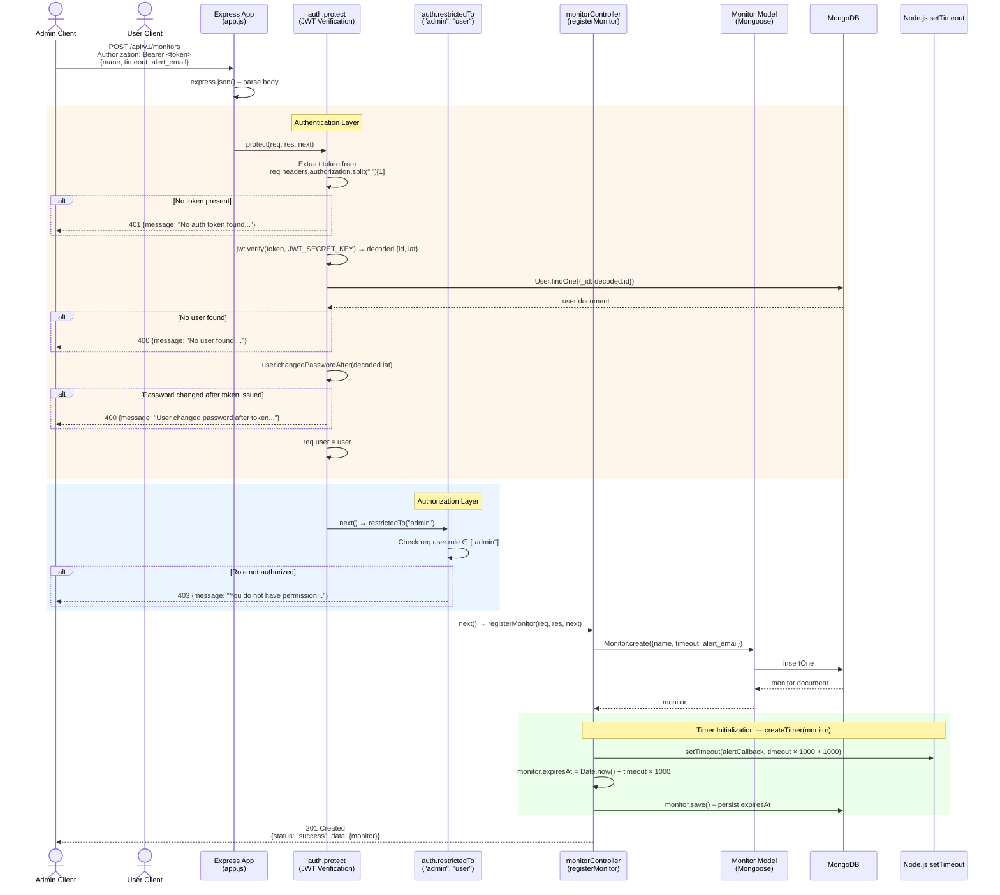
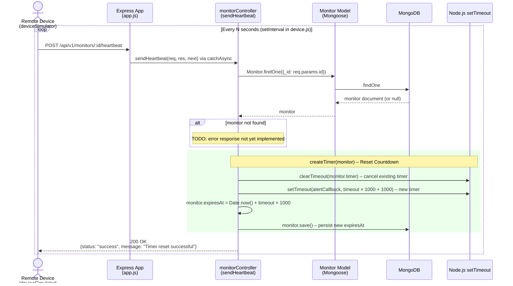
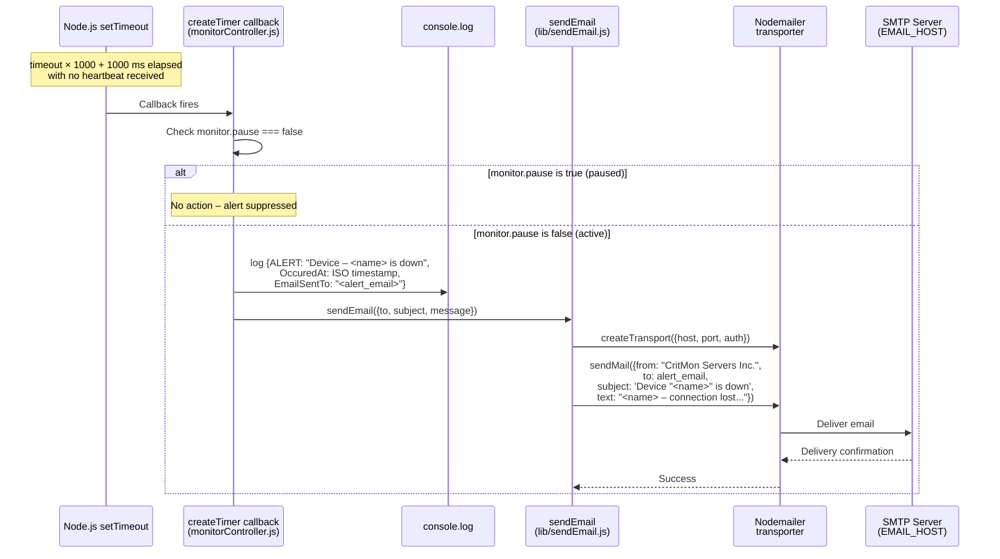
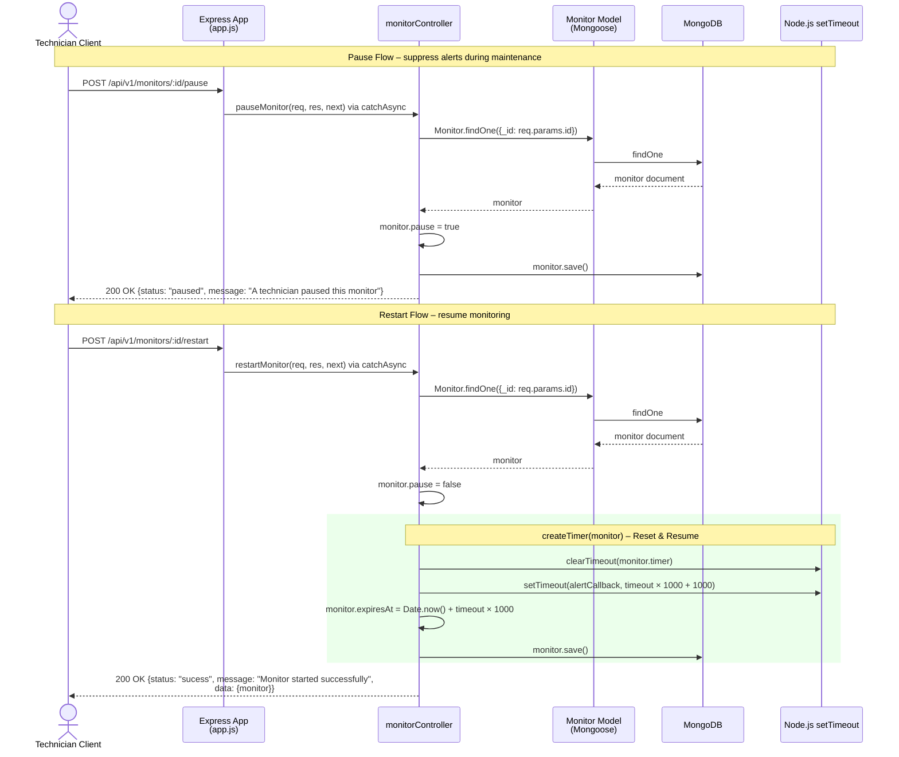
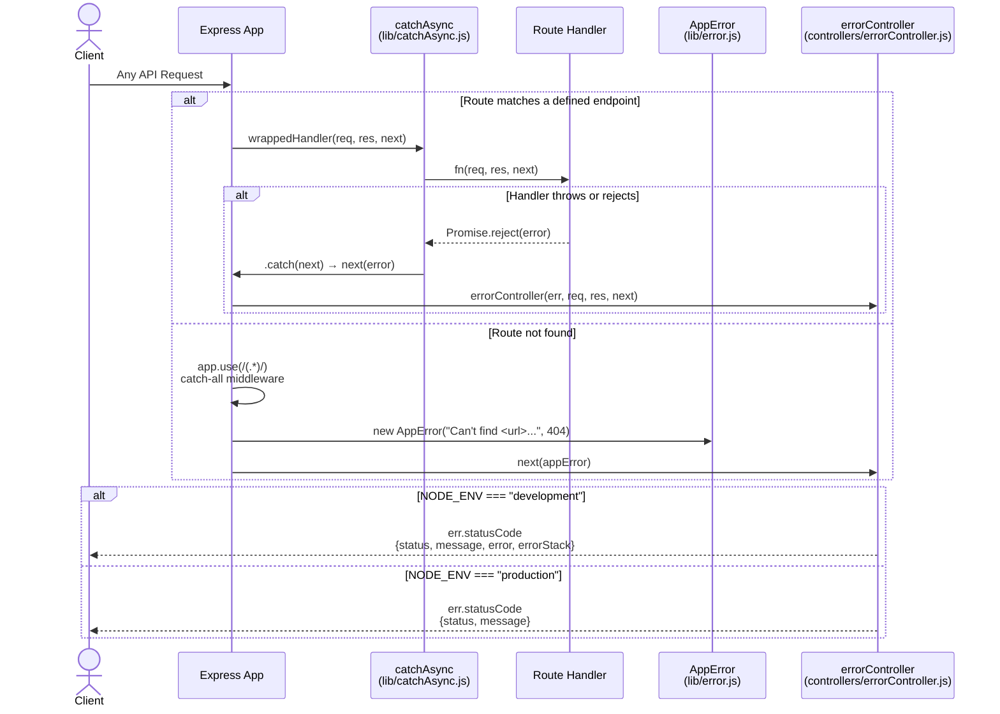

# Pulse-Check-API: Dead Man's Switch Monitoring System

A production-ready backend service for monitoring remote devices (solar farms, weather stations, IoT devices) in areas with poor connectivity. Devices register "heartbeat" timers; if they fail to ping the server before timeout, the system automatically triggers alerts via email.

## Project Overview

**Problem:** CritMon Servers Inc. has no way to detect when remote devices go offline until someone manually checks logs. This results in delayed responses to solar farm power failures or stolen weather stations.

**Solution:** A stateful timer-based monitoring API that:

- Tracks device heartbeats with countdown timers
- Automatically alerts when a device stops communicating
- Supports pause/resume for maintenance windows
- Includes role-based access control and JWT authentication
- Sends email notifications to designated alert contacts

**Tech Stack:** Node.js, Express, MongoDB, JWT, Nodemailer, Bcrypt

---

## Setup Instructions

### Prerequisites

- Node.js 16+ and npm
- MongoDB instance (local or cloud)
- Email credentials (for Nodemailer)

### Installation

```bash
# Clone the repository
git clone <your-repo-url>
cd pulse-check-api

# Install dependencies
npm install

# Configure environment variables
cp config.env.example config.env
# Edit config.env with your values:
# - MONGO_URL
# - JWT_SECRET_KEY
# - JWT_EXPIRES_IN
# - NODE_ENV
# - EMAIL_HOST, EMAIL_PORT, EMAIL_USER, EMAIL_PASS
```

### Running the Server

```bash
# Development (with nodemon)
npm start

# Run device simulator
npm run start:device
```

Server will start on `http://localhost:3000`

---

## Architecture & System Flow

### 1.0 User Signup & JWT Issuance



### 1.1 Register Monitor (Admin & User Protected)



### 1.2 Device Heartbeat (Timer Reset)



### 1.3 Timer Expiry → Alert & Email Notification



### 1.4 Pause & Restart Monitor



### 1.5 Global Error Handling Pipeline



---

## API Documentation

### Authentication Endpoints

**POST `/api/v1/users/signup`** — Create a new user account

```json
{
  "name": "John Admin",
  "email": "admin@critmon.com",
  "password": "SecurePassword123",
  "passwordConfirm": "SecurePassword123",
  "role": "admin"
}
```

Response: `201 Created` with JWT token

---

**POST `/api/v1/users/login`** — Login and get JWT token

```json
{
  "email": "admin@critmon.com",
  "password": "SecurePassword123"
}
```

Response: `200 OK` with JWT token

---

### Monitor Endpoints

**POST `/api/v1/monitors`** — Register a new monitor (admin and users only)

```json
{
  "name": "Database Server 01",
  "timeout": 30,
  "alert_email": "ops@company.com"
}
```

Response: `201 Created`

---

**POST `/api/v1/monitors/:id/heartbeat`** — Send a heartbeat to reset the timer

Response: `200 OK`

---

**POST `/api/v1/monitors/:id/pause`** — Pause a monitor (technician only)

Response: `200 OK`

---

**POST `/api/v1/monitors/:id/restart`** — Restart a paused monitor (technician only)

Response: `200 OK`

---

## The User Model

The user model helps the company add new users to the platform and secure access to protected routes.
It enforces required identity fields and handles password safety on save.

**Required fields**

- `name` (string): Required user display name.
- `email` (string): Required and validated as a proper email address.
- `password` (string): Required, minimum length 8 characters, stored as a bcrypt hash.
- `passwordConfirm` (string): Must match `password` during signup.

**Optional fields**

- `role` (string): One of `administrator`, `technician`, `user` or `engineer` (defaults to `user`).
- `passwordChangedAt` (date): Used to invalidate JWTs after a password change.

**Model behavior**

- Before saving, the password is hashed with bcrypt and `passwordConfirm` is removed from storage.
- `changedPasswordAfter()` checks if a token was issued before the most recent password change.
- `correctPassword()` compares a candidate password to the stored hash during login.

---

## Authentication

Authentication and authorization logic lives in [controller/authController.js](controller/authController.js).

**Endpoints**

- `POST /api/v1/users/signup` creates a user and returns a JWT.
- `POST /api/v1/users/login` validates credentials and returns a JWT.

**JWT handling**

- When a user is signing up the user must provide `name, email, password and passwordConfirm` (this is deleted after the password is encrypted, and should match the password field during signup) and an optional `role` field which defaults to `administrator` when no role is provided during signup`

- Tokens are created with `signToken(id)` using `JWT_SECRET_KEY` and `JWT_EXPIRES_IN`.
- Clients must send `Authorization: Bearer <token>` for protected routes.

**Middleware**

- `protect` verifies the bearer token, loads the user, and checks `changedPasswordAfter`, if password was changed after the token was issued, the user is asked to login again.
- `restrictedTo(...roles)` enforces role-based access (used after `protect`).

**Notes**

- Login selects the password hash (`.select("+password")`) to verify credentials, since by default the password is set to `select: false`.
- Errors are forwarded to the `Global Error Handler` through `AppError` where applicable.

---

## Middleware Overview

This project uses a small set of middleware functions to parse requests, guard routes, and centralize error handling. Most of them are registered in [app.js](app.js) and the auth guards live in [controller/authController.js](controller/authController.js).

**Request and logging middleware**

- `express.json()` parses JSON request bodies so handlers can access `req.body`.
- `morgan("dev")` logs requests in development mode when `NODE_ENV` is set to `development`.

**Routing middleware**

- `app.use("/api/v1/users", userRouter)` mounts the user routes defined in [routes/userRoutes.js](routes/userRoutes.js).

**Auth middleware**

- `protect` verifies JWTs, loads the user record, and blocks requests without a valid token.
- `restrictedTo(...roles)` enforces role-based access after `protect` has attached `req.user`.

**Global error handling**

- `app.use(/(.*)/, ...)` is a catch-all that creates a 404 when no route matches and forwards the error with `next(...)`.
- [controller/errorController.js](controller/errorController.js) is the final error-handling middleware. It formats error responses differently for `development` vs `production`, returning stack traces only in development.

- Asynchronous errors like `failed Database Connection` are handled gracefully so that our app does not crash. This is done by using `process.on("unhandledRejection")` this catches all possible skipped errors that results from asynchronous functions that wasn't well handled
- Similarly, synchronous errors like trying to access undefined variables are handled gracefully, however these errors should really crash our apps so as to be attended to immediately. These errors are handled using `process.on("uncaughtException")`.

---

## Monitor Controller

The Monitor Controller handles device monitoring, heartbeat tracking, and alert management. It lives in [controller/monitorController.js](controller/monitorController.js) and is mounted at routes in [routes/monitorRoutes.js](routes/monitorRoutes.js).

**What it does**

Device monitors are like "dead man's switches"—they expect regular heartbeats from remote devices. If no heartbeat arrives within a timeout window, the system logs an alert and sends an email to the designated contact.

### API Endpoints

**POST `/api/v1/monitors`** — Register a new monitor (admin only)

Request body:

```json
{
  "name": "Database Server 01",
  "timeout": 30,
  "alert_email": "ops@company.com"
}
```

Response (201 Created):

```json
{
  "status": "success",
  "data": {
    "monitor": {
      "_id": "507f1f77bcf86cd799439011",
      "name": "Database Server 01",
      "timeout": 30,
      "alert_email": "ops@company.com",
      "pause": false,
      "expiresAt": "2026-02-10T15:30:00.000Z"
    }
  }
}
```

---

**POST `/api/v1/monitors/:id/heartbeat`** — Send a heartbeat to reset the timer

Request body: (empty or no specific fields required)

Response (200 OK):

```json
{
  "status": "success",
  "message": "Timer reset successful"
}
```

---

**POST `/api/v1/monitors/:id/pause`** — Pause a monitor (technician only)

Request body: (empty)

Response (200 OK):

```json
{
  "status": "paused",
  "message": "A technician paused this monitor"
}
```

---

**POST `/api/v1/monitors/:id/restart`** — Restart a paused monitor (technician only)

Request body: (empty)

Response (200 OK):

```json
{
  "status": "sucess",
  "message": "Monitor started successfully",
  "data": {
    "monitor": {
      "_id": "507f1f77bcf86cd799439011",
      "name": "Database Server 01",
      "timeout": 30,
      "alert_email": "ops@company.com",
      "pause": false,
      "expiresAt": "2026-02-10T15:30:00.000Z"
    }
  }
}
```

### Core Functions

**`createTimer(monitor)`**

Internal helper that manages the countdown timer for a monitor. This function:

- Clears any existing timer on the monitor
- Sets a new timer that fires if no heartbeat is received within `monitor.timeout` seconds (plus 1 second grace period)
- When the timer fires, if the monitor is not paused, it logs the alert to console and sends an email via `sendEmail()`
- Updates `monitor.expiresAt` with the new expiration timestamp and persists it to the database

This is called automatically after registering a monitor, receiving a heartbeat, or restarting a paused monitor.

---

**`registerMonitor(req, res, next)`**

Creates a new device monitor. Requires admin role.

- Extracts `name`, `timeout`, and `alert_email` from request body
- Creates a monitor document in MongoDB
- Initializes the countdown timer via `createTimer()`
- Returns the newly created monitor with a 201 status

---

**`sendHeartbeat(req, res, next)`**

Resets the countdown timer for a monitor when a device sends a heartbeat.

- Finds the monitor by `:id` parameter
- Calls `createTimer()` to reset the countdown
- Returns a 200 success response

---

**`pauseMonitor(req, res, next)`**

Pauses a monitor to suppress alerts during downtime or maintenance. Requires technician role.

- Finds the monitor by `:id` parameter
- Sets `monitor.pause = true` and saves
- When paused, the timer still runs but no alert emails are sent
- Returns a 200 response with status "paused"

---

**`restartMonitor(req, res, next)`**

Resumes a paused monitor. Requires technician role.

- Finds the monitor by `:id` parameter
- Sets `monitor.pause = false`
- Reinitializes the timer via `createTimer()`
- Returns the updated monitor with a 200 status

---

## Device Simulator

The device simulator mimics real remote devices sending heartbeats to the monitoring system. It allows you to test the monitor functionality without deploying actual hardware. The simulator lives in [simulator/device.js](simulator/device.js) and [simulator/run-device.js](simulator/run-device.js).

### How It Works

**`sendPing(id)`** in [simulator/device.js](simulator/device.js):

- Takes a monitor ID as input
- Uses Node.js `setInterval()` to send heartbeat requests every 50 seconds
- Each heartbeat is a `POST` request to `/api/v1/monitors/:id/heartbeat`
- Logs "Heartbeat sent!" on success or logs the HTTP status code on failure
- Returns a cleanup function to stop the heartbeat (prevents memory leaks)

### Running a Device Simulator

**Quick start with the default device:**

```bash
node simulator/run-device.js
```

The default script in [simulator/run-device.js](simulator/run-device.js) starts a simulator for the hardcoded monitor ID `698a88dadd70f3d4e481a1c2`.

**Running a simulation for a specific device:**

You can modify [simulator/run-device.js](simulator/run-device.js) to replace the monitor ID or create a new script:

```javascript
const device = require("./simulator/device");

// Start simulator for your monitor
const stopDevice = device("YOUR_MONITOR_ID_HERE");

console.log("Device is alive and sending heartbeats!");

// Graceful shutdown on Ctrl+C
process.on("SIGINT", () => {
  console.log("Stopping device simulator...");
  stopDevice();
  process.exit();
});
```

### Testing the Monitor System

1. **Start the server:**

   ```bash
   npm start
   ```

2. **Create a monitor** (via API or admin panel) with a monitor ID and short timeout (e.g., 60 seconds).

3. **Start the device simulator** with that monitor ID:

   ```bash
   node simulator/run-device.js
   ```

   (or update the ID in the file first)

4. **Observe behavior:**
   - While the simulator is running, heartbeats reset the timer every 50 seconds.
   - The monitor will stay healthy and not trigger alerts.
   - If you stop the simulator, the monitor will time out and send an alert email and also log to the console to alert user that an email was sent.
   - You (remember to login/signup as a technician) can pause the monitor and resume it without changing the simulator.

### Notes

- Heartbeat interval is **50 seconds**, this can be modified to fit companies criteria (so the monitor should have a `timeout` of at least 50 to avoid false alerts).
- Each simulator instance sends one heartbeat every 50 seconds; multiple simulators can run simultaneously to test multiple devices.
- Errors during heartbeat (network issues, server down) are logged to console but don't stop the simulator.
- Use `Ctrl+C` to gracefully stop the simulator and clean up the interval.

---

## Developer's Choice: Features Beyond Requirement

### Comprehensive Authentication & Authorization System

**Features Added:**

- JWT-based authentication with secure token signing and verification
- Bcrypt password hashing (cost factor 12) with salt rounds
- Role-based access control (RBAC) with three user roles: `admin`, `technician`, `engineer`
- Protected routes middleware (`protect`) that validates JWT tokens and checks user existence
- Role-restricted endpoints (`restrictedTo`) that enforce granular permissions
- Password change detection to invalidate old tokens (`changedPasswordAfter`)
- Secure credential validation without storing plain-text passwords

**Why This Was Essential:**
The challenge requirement was minimal: "allow a client to create a monitor" with no mention of authentication. However, a production monitoring system for critical infrastructure **must** protect against:

1. **Unauthorized Access** — Attackers could register fake monitors, spam the alert system, or delete critical monitors without authentication
2. **Server Abuse/DOS** — Without authentication, the `/monitors/:id/heartbeat` endpoint could be flooded with requests from untrusted sources, this could be further improved by adding rate-limiting
3. **Data Breaches** — Storing passwords in plain text would expose customer data. Bcrypt with proper hashing prevents this
4. **Privilege Escalation** — Without RBAC, any authenticated user could perform admin actions (registering monitors)
5. **Token Hijacking** — Checking `changedPasswordAfter(iat)` ensures compromised tokens are invalidated when passwords change

**Implementation Details:**

- `signup` endpoint creates users with hashed passwords and issues JWT tokens
- `login` endpoint validates credentials and returns fresh tokens
- All monitor endpoints are protected by `auth.protect` middleware
- Admin operations (register monitor) additionally require `auth.restrictedTo("admin")`
- Technician operations (pause/restart) require `auth.restrictedTo("technician")`
- Global error handler catches auth failures and returns appropriate HTTP status codes (401, 403)

**Real-World Impact:**
This transforms a proof-of-concept into enterprise-grade infrastructure monitoring. CritMon can now safely deploy this to production knowing that:

- Only authorized admins can create monitors
- Device heartbeats cannot be spoofed by attackers
- Staff permissions scale with organizational roles
- Alert notifications won't be triggered by spam requests

---

## Additional Features Beyond Requirement

### Pause & Resume Monitoring

**Feature:** Temporary alert suppression during maintenance windows

- Technicians can pause monitors without deletion
- Timer still runs but no emails are sent when paused
- Resume immediately restarts counting down

**Why:** Ops teams need to perform maintenance. Without this, they'd either delete monitors (losing history) or ignore alerts (defeating the purpose).

### Email Alert Integration

**Feature:** Automated email notifications when devices timeout

- Integrated Nodemailer with SMTP support
- Console logging for debugging
- Alert includes device name, timestamp, and contact email

**Why:** Console logs alone don't scale for distributed ops teams. Email creates accountability and ensures alerts reach the right person.

- Additionally, JWT's can be sent securely over a cookie as an HTTPOnly field, this is to ensure that important fields like the jwt tokens cannnot be accessed and modified by the client's browser.

---

## Project Structure

```
Dead-Man-API/
├── controller/          # Business logic & handler functions
│   ├── authController.js       # JWT, password hashing, RBAC middleware
│   ├── errorController.js      # Global error handling
│   └── monitorController.js    # Monitor CRUD & timer logic
├── model/               # Database schemas
│   ├── userModel.js            # User with secure password handling
│   └── monitorModel.js         # Monitor with pause flag & expiry
├── routes/              # API route definitions
│   ├── userRoutes.js           # Signup & login endpoints
│   └── monitorRoutes.js        # Monitor endpoints with auth guards
├── simulator/           # Device simulation for testing
│   ├── device.js               # Heartbeat sender function
│   └── run-device.js           # Test harness entry point
├── utils/               # Utility functions & middleware
│   ├── catchAsync.js           # Async error wrapper
│   ├── error.js                # Custom Error class
│   └── sendEmail.js            # Email functionality
├── app.js               # Express app configuration
├── server.js            # Server entry point
├── config.env           # Environment variables (NOT in git)
└── package.json         # Dependencies
```

---
